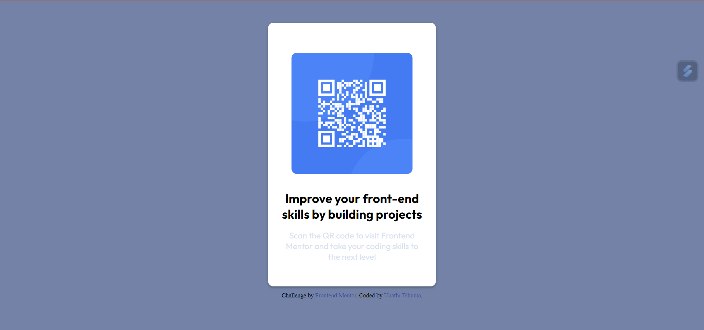

# Frontend Mentor - QR code component solution

This is a solution to the [QR code component challenge on Frontend Mentor](https://www.frontendmentor.io/challenges/qr-code-component-iux_sIO_H). Frontend Mentor challenges help you improve your coding skills by building realistic projects. 

## Table of contents

- [Overview](#overview)
  - [Screenshot](#screenshot)
  - [Links](#links)
- [My process](#my-process)
  - [Built with](#built-with)
  - [What I learned](#what-i-learned)
  - [Continued development](#continued-development)
  - [Useful resources](#useful-resources)
- [Author](#author)


## Overview

### Screenshot

- Solution:


### Links

- Solution URL: [QR Code design](https://github.com/zerobbreak/QR-code-design)
- Live Site URL: [Add live site URL here](https://your-live-site-url.com)

## My process

### Built with

- Vanila HTML
- Vanila CSS
- Flexbox 

### What I learned
I learned to design a card and align all the items to the center using the concepts i learnt. I used CSS variables to call the different colors and fonts that were needed for the code design itself. 


```html
 <div class="card-container">
    <div class="image-qr__code">
      
    </div>

    <div class="card__text">
      <h2>  Improve your front-end skills by building projects</h2>
      <p>  Scan the QR code to visit Frontend Mentor and take your coding skills to the next level</p>
    </div>
  </div>

  <div class="attribution">
    Challenge by <a href="https://www.frontendmentor.io?ref=challenge" target="_blank">Frontend Mentor</a>.
    Coded by <a href="https://github.com/zerobbreak">Unathi Tshuma</a>.
  </div>
```
```css
.card-container{
    display: flex;
    justify-content: center;
    flex-direction: column;
    align-items: center;
    width: 25%;
    height: 480px;
    box-shadow: 0 2px 4px rgba(0, 0, 0, 0.3);
    margin: 30px;
    padding: 10px;
    border-radius: 10px;
    /* padding: 20px; */
    background-color: var(---white-background);
}

.image-qr__code{
    display: flex;
    justify-content: center;
    align-items: center;
    flex-direction: column;
    margin: 20px;
}

.image-qr__code img{
    width: 90%;
    border-radius: 10px;
}

.card__text{
    display: flex;
    justify-content: center;
    align-items: center;
    flex-direction: column;
    margin: 10px;
}

.card__text h2{
    font-family: var(--font-h1);
    font-weight: var(--font-h1-weight);
    text-align: center;
    margin-bottom: 15px;
}

.card__text p{
    font-size: 15px;
    font-family: var(--font-paragraph);
    font-weight: var(--font-paragraph-weight);
    color: var(--font-colour);
    text-align: center;
}
```

### Continued development

This project was a test to see how far my skills have come when it comes to designing websites and getting a basic understanding of how far I have come with HTML and CSS. In the future I would like to design something more complex to seriously testing my skills but this project is a great example of how i have mastered the fundamentals.

### Useful resources

- [The Odin Project](https://www.theodinproject.com) - This helped me for understanding the fundamentals due to its foundations course which teaches you the fundamentals.

## Author

- Frontend Mentor - [@zerobbreak](https://www.frontendmentor.io/profile/zerobbreak)


